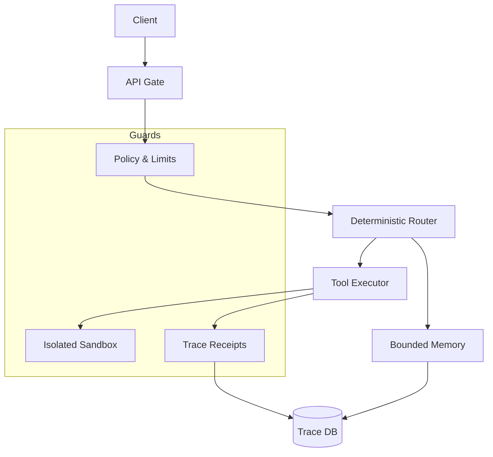

# The Unavoidable Architecture

**Purpose:** A clear, decisive blueprint that makes Orchestrators v2 feel inevitable—without sacrificing restraint, privacy, or operational sanity.

## The Premise

Most agent frameworks optimize for speed of demos. Orchestrators v2 optimizes for **trust under pressure**. The Unavoidable Architecture formalizes that advantage into a system that is easy to explain, hard to misuse, and trivial to audit.

## The Five Non-Negotiables

1. **Bounded memory** — State is capped, deliberate, and prunable.
2. **Receipts** — Every decision emits a trace you can replay.
3. **Rehearsal** — Dry-run is a first-class path, not a bolt-on.
4. **Default-off** — Risky modules are opt-in, never implied.
5. **Automation with consent** — No silent escalation beyond policy.

These are not slogans. They are architectural constraints.

## The Architecture in One Picture

## The Three-Layer Contract

### 1) **Control Plane**
- API gate, auth, rate limits, schema validation.
- Enforces policy before any work begins.

### 2) **Decision Plane**
- Deterministic routing with strict tool policies.
- Optional semantic routing is bounded and observable.

### 3) **Execution Plane**
- Tools are isolated by default.
- Sandboxing is mandatory for unsafe operations.
- All outputs are scrubbed and capped.

## What Makes It “Unavoidable”

**Clarity:** It is easier to explain than most alternatives.

**Auditability:** It is easier to verify than most alternatives.

**Composability:** It integrates with any model or tool without rewriting the core.

**Defensive defaults:** It avoids failure modes that typically derail adoption in regulated environments.

## Enterprise Adoption Path (No Wishful Thinking)

**Phase 1 — Pilot**
- Local deployment, bounded tools, receipts only.
- Prove audit and safety flows.

**Phase 2 — Harden**
- Add Redis-backed rate limits.
- Move traces and memory to Postgres.
- Enable observability stack.

**Phase 3 — Expand**
- Add domain tools behind sandbox.
- Enable selective memory capture.
- Introduce rehearsal mode for new tools.

## Operator Guarantees

If it’s not in a receipt, it didn’t happen.

If it’s not explicitly enabled, it’s off.

If it’s unsafe, it runs in a container or it doesn’t run.

## Architecture Commitments (v2.0+)

- **No hidden state.**
- **No silent network access.**
- **No unbounded memory.**
- **No unreviewable tool calls.**

This is the discipline the industry needs—and the reason this system is difficult to ignore.